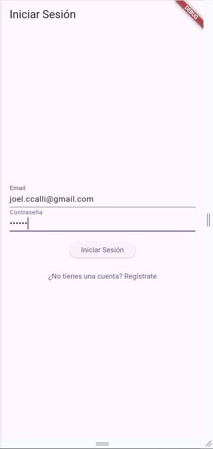
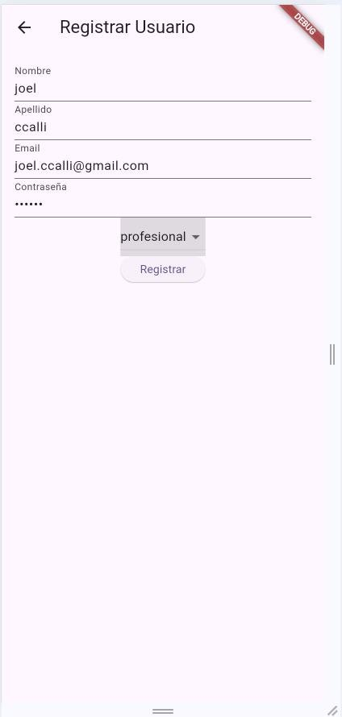

Universidad Privada de Tacna   ![ref1]![ref1]![ref1]![ref1]

Facultad de Ingeniería![ref1]   ![ref2]![ref1]![ref1]![ref3]

Escuela Profesional de Ingeniería de Sistemas   ![ref1]![ref1]![ref2]![ref1]![ref3]![ref1]![ref2]![ref1]![ref1]

“Año del Bicentenario, de la consolidación de nuestra Independencia, y de la conmemoración de las heroicas batallas de Junín y Ayacucho” 

**FACULTAD DE INGENIERÍA**   

**ESCUELA PROFESIONAL DE INGENIERÍA DE SISTEMAS**   

NOMBRE DEL TRABAJO: “Examen Practico**”**  

TEMA DEL TRABAJO*:* **“Examen Practico de Soluciones Moviles 2”**  **Integrantes:** 

|**Nº**  |**Código Universitario**  |**Apellidos y Nombres** |
| - | - | - |
|**1.-**  |**2017057528**  |**Ccalli Chata Joel Robert**  |

**CURSO**    **:**    **“Soluciones Moviles 2”** 

**SECCION**   **:**   **“A”**   

**DOCENTE**  **:**   **Ing. “Oscar Juan Jimenez Flores”**  

**Tacna - Perú**  **2024** 

Link! Repositorio PUBLICO DE GITHUB: [https://github.com/joelccalli/SM2_EXAMEN_PRACTICO.git ](https://github.com/joelccalli/SM2_EXAMEN_PRACTICO.git)

\# SM2\_EXAMEN\_PRACTICO 

Este repositorio contiene el examen práctico de la Unidad II, desarrollado como parte de la App de Historias Clínicas en Flutter y SQLite. 

\## 1. Selección de Historias del Product Backlog 

Las historias seleccionadas para la implementación en esta práctica son: 

- \*\*Consulta de Historias Clínicas\*\*: Permite a los usuarios visualizar detalles de las historias clínicas almacenadas. 
- \*\*Registro de Pacientes\*\*: Funcionalidad para registrar nuevos pacientes en el sistema de historias clínicas. 

  ## 2. Creación del Repositorio en GitHub 

- Este repositorio se creó específicamente para el examen práctico con el nombre  SM2\_EXAMEN\_PRACTICO . 
- El repositorio es público para que pueda ser evaluado sin restricciones. 
- Al crear el repositorio, se inicializó con un archivo  README.md , completado con la estructura y contenido solicitados en las instrucciones. 

  ## 3. Subir las Historias Implementadas a GitHub 

  Las historias seleccionadas han sido implementadas en la aplicación y subidas a este repositorio. 

  ## 4. Documentación en el README ### Descripción del Proyecto 

  La aplicación de \*\*Historias Clínicas\*\* permite gestionar y consultar la información de pacientes, facilitando el acceso rápido a sus registros. Las funcionalidades implementadas en esta práctica incluyen: 

1. \*\*Consulta de Historias Clínicas\*\*: 
- Los usuarios pueden acceder a una vista detallada de las historias clínicas de cada paciente. 
- \*\*Estado\*\*: Finalizado 
- \*\*Captura\*\*: 

`     ` 

2. \*\*Registro de Pacientes\*\*: 
- Se permite el registro de nuevos pacientes, almacenando sus datos en la base de datos 

SQLite. 

- \*\*Estado\*\*: Finalizado 
- \*\*Captura\*\*: 

`     ` 

\### Enlaces y Referencias 

- \*\*Flutter\*\*: [https://flutter.dev](https://flutter.dev) 
- \*\*SQLite\*\*: [https://www.sqlite.org](https://www.sqlite.org) 

\## 5. Conversión del README a PDF 

Este  README.md  ha sido convertido a PDF para su presentación en el aula virtual, incluyendo el enlace al repositorio de GitHub para su revisión. 

\--- 

[Repositorio en GitHub](URL\_DEL\_REPOSITORIO) 

[ref1]: Aspose.Words.cd9a1934-6dcd-4b97-9e14-e342406b2511.003.png
[ref2]: Aspose.Words.cd9a1934-6dcd-4b97-9e14-e342406b2511.005.png
[ref3]: Aspose.Words.cd9a1934-6dcd-4b97-9e14-e342406b2511.009.png
